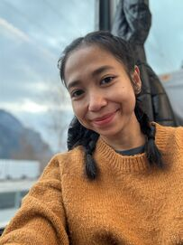

# Hi there! I'm Rohma ☀️

## 👋 Welcome to My GitHub Profile!

Hello, I'm Rohma, an Indonesian living in Belgium. I'm passionate about design
and front-end development. In my free time, you can find me experimenting with
new recipes, baking sweet treats, and nurturing my garden.

## 🌟 "Dream, Believe, and Make It Happen!"

- 🇮🇩 My mother tongue is Indonesian.
- 🌍 I speak English, Dutch, and a bit of German.

## 💻 Currently on a Front-End Development Journey

I'm on a quest to become a proficient front-end developer. Here's what I'm
currently up to:

- 🚀 Mastering software testing.
- 🔧 Learning and honing my skills in JavaScript, HTML, SCSS.
- 🅰️ Exploring the wonders of Angular.
- 🦀 Dabbling in Rust.
- ⚛️ Getting to know React.

## 📚 Future Learning Goals

I'm excited about expanding my knowledge even further. In the near future, I
plan to delve into:

- 🐍 Python

Let's connect, collaborate, and create something amazing together! Feel free to
explore my repositories and don't hesitate to reach out. 😊

---

_"Success is not final, failure is not fatal: It is the courage to continue that
counts." - Winston Churchill_
